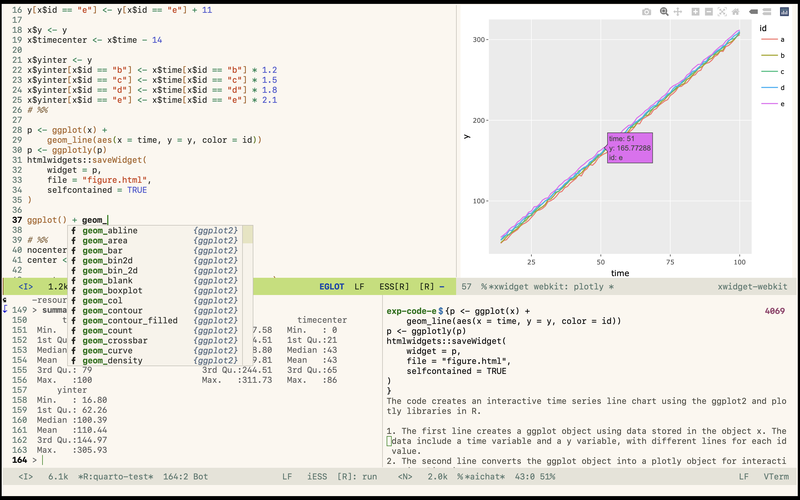

# Table of Contents

1.  [Features](#orgef503bf)
    1.  [Blazing fast.](#org52e05bb)
    2.  [Robust](#org8a50532)
    3.  [Compatability](#org7bfe6a0)
    4.  [Feature rich](#org7c20c41)
    5.  [Be wild](#org73ca09c)
2.  [Showcase](#org5ecbf31)
    1.  [Welcome screen](#org5c8adf8)
    2.  [Code Navigation](#org39122a0)
    3.  [Data Science](#org8fbdd3a)
    4.  [Orgmode](#org14526df)
3.  [Email Setup](#org03eb333)
4.  [TODOs](#orgbb32cc6)
    1.  [Report `org-capture` bugs when inserting entries into table to upstream.](#org3b5aeae)
    2.  [Utilize the contextual information from previous code block when editing source block within markdown/org.](#orgcb06ade)
    3.  [Lazily load third-party plugins for `evil`.](#org2d5a4df)
    4.  [Configure `evil-args` to use spaces as argument delimiter for `emacs-lisp-mode`.](#orgb58631b)
5.  [Prerequisites](#orga74f596)
6.  [External Dependencies](#org3b833b6)
7.  [Discussion](#orgd17873d)

If you&rsquo;re currently reading this README file in Markdown format, it
has been generated through `org-export`, from its original org
format. For the best experience, please consider reading the org
format file instead.

****NOTE****: This configuration requires Emacs 30 or later. For
compatibility with earlier versions, please use the \`emacs-29-compat\`
branch.

# Features

## Blazing fast.

With TTY starting in 0.23 seconds on a MacBook Air (M1, 2020), 0.73
seconds on a VPS with a 1-core CPU and 1 GB RAM, and 0.21 seconds on
WSL with Intel i7 CPU and 32 GB RAM, TTY is exceptionally fast. The
GUI is just as quick, starting in 0.40 seconds on Mac M1 and 0.30
seconds on WSLg.

## Robust

Package versions are locked and under version control, so no breaking
changes are expected.

## Compatability

This configuration works well on both TTY and GUI. Compatibility on
TTY is not compromised, while GUI features, including `xwidget`, are
also well-configured.

## Feature rich

A blazing fast startup speed doesn&rsquo;t mean it is a lite and minimal
configuration.  Instead, it is &ldquo;heavy&rdquo; and feature rich, including:

-   A modern minibuffer completion experience powered by `vertico+consult+orderless+embark+marginalia` family bucket.

-   Modal editing ecosystem everywhere, powered by `evil` and many other extensions.

-   A keybinding scheme centered around leader and localleader keys, powered by `general` and `which-key`.

-   In-buffer autocompletion frontend based on `company`

-   Code completion and navigation based on `eglot` (LSP) and `citre` (Ctags).

-   Integration with `eglot` and `org-babel` or `markdown-mode` that takes literate programming to the next level.

## Be wild

Randomly select a theme from a curated list each time you start up and
automatically switches between day and night themes at scheduled time.
Additionally, the displayed verses on the welcome screen is also
randomized with each launch. Have a fresh experience at every time. Be
casual and wild!

# Showcase

## Welcome screen

The welcome screen displays two randomly chosen verses from my
carefully chosen collection.  This serves as a scratch buffer where
you can perform Lisp evaluations. Frequently used commands are also
listed, allowing for convenient execution by simply typing the hint
key.

## Code Navigation

Making use of LSP and Ctags, navigating code is a breeze. The file
tree is displayed on the leftmost window through `dired-sidebar`, and
the bottom right window showcases the references of a selected symbol
via `LSP find references` (the Emacs command is
`xref-find-references`). In the central floating window, a preview of
the definition of the chosen symbol is displayed with the aid of
`ctags` (the Emacs command is `citre-peek`).

## Data Science

A typical workflow in data science involves multiple components. The
top right window showcases an embedded xwidget widget that displays
the HTML visualization created via `plotly`. In the bottom left window
rests the R REPL console where you can send your code for
execution. Meanwhile, the bottom right window features a chatgpt REPL
console (via [aichat](https://github.com/sigoden/aichat)). I specify
the aichat mode as `exp-code-e` to prompt chatgpt to provide an
explanation of the code you sent.

## Orgmode

Write prose in `orgmode`, and export it into `reveal.js` presentation.
The right window displays the HTML slides using xwidget
webkit. Preview slides in emacs without the need to open GUI browser
anymore.

# Email Setup

I use `notmuch` as my email client. For a comprehensive overview of my
email setup, please refer to the [email.org](./email.md) file
located in the current directory.

# TODOs

## Report `org-capture` bugs when inserting entries into table to upstream.

## Utilize the contextual information from previous code block when editing source block within markdown/org.

## Lazily load third-party plugins for `evil`.

## Configure `evil-args` to use spaces as argument delimiter for `emacs-lisp-mode`.

# Prerequisites

-   This configuration is designed for Emacs 29 or newer versions.
-   Your Emacs must be built with Treesitter support for this
    configuration to work effectively. If you are using a widely used
    package manager, and said manager has updated Emacs to version 29 or
    later, it&rsquo;s highly probable that Treesitter is already built into
    the Emacs version provided via the package manager. We advise
    verifying the package specifications for exact details if you choose
    to leverage a package manager-built Emacs.
-   A separate installation is required for Treesitter grammar.  You can
    execute the command `M-x mg-treesit-install-all-language-grammar` to
    install all the language grammars that are currently in use.

# External Dependencies

This configuration requires the following core dependencies:

-   A C compiler for building the treesitter grammar
-   universal-ctags
-   ripgrep

There are also additional language-specific dependencies only required
when working with specific languages. These typically include language
servers, formatters, and linters. For instance, you would need
`basedpyright`, `debugpy`, `black`, and `ipython` for python.

# Discussion

-   It is recommended to use the mailing list `~northyear/.emacs.d-devel@lists.sr.ht`.
-   Alternatively, you are also welcome to open a Github issue.

