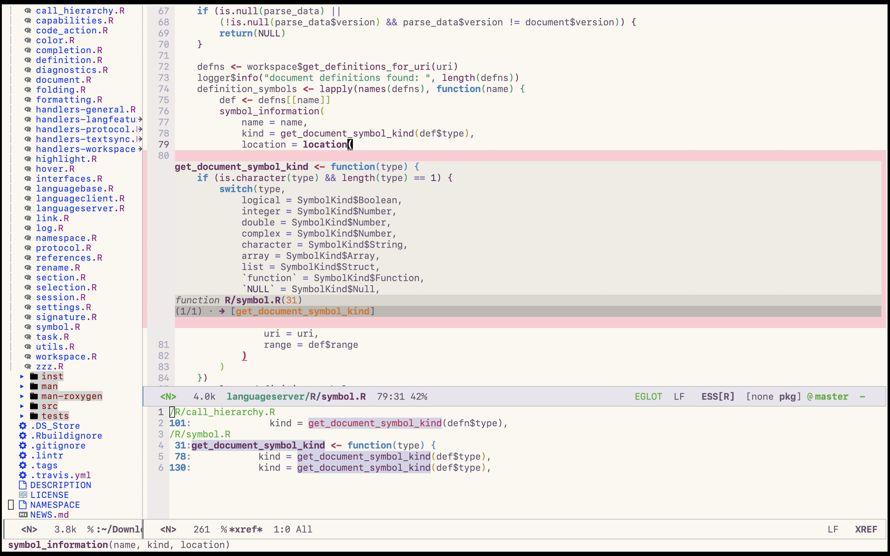

# Table of Contents

1.  [Features](#orgd351237)
    1.  [Blazing fast.](#org29795f2)
    2.  [Robust](#org4c058e7)
    3.  [Compatability](#org2afc862)
    4.  [Feature rich](#orgb430cc4)
    5.  [Be wild](#org41f0698)
2.  [Showcase](#org22de6d1)
    1.  [Welcome screen](#orgce56406)
    2.  [Code Navigation](#org0a9f729)
    3.  [Data Science](#org2eee4f2)
    4.  [Orgmode](#org5b07e1d)
3.  [TODOs](#orgc871b8b)
    1.  [Remove my workaround hack once evil-collection addresses the compatibility issue caused by the breaking changes in mu 1.10+.](#org97aa03c)
    2.  [Update `lisp-indent-function` from Doomemacs.](#org3179f43)
    3.  [Report `org-capture` bugs when inserting entries into table to upstream.](#orgd4a663c)
    4.  [Utilize the contextual information from previous code block when editing source block within markdown/org.](#org3adbfc8)
    5.  [Lazily load third-party plugins for `evil`.](#orgee9ef00)
    6.  [Configure `evil-args` to use spaces as argument delimiter for `emacs-lisp-mode`.](#orgb3e1c12)
    7.  [Implement thread-folding for `mu4e`.](#org190af46)
4.  [Notes](#org8f1f982)
    1.  [Startup speed](#org76d1b67)
    2.  [Naming conventions (WIP)](#org5ceb0a3)
    3.  [Corfu or Company?](#orgea7deb8)

If you&rsquo;re currently reading this README file in Markdown format, it
has been generated through `org-export`, from its original org
format. For the best experience, please consider reading the org
format file instead.

# Features

## Blazing fast.

TTY starts in 0.32s on MacBook Air (M1, 2020), 0.73s on a VPS with 1
core CPU and 1 GB RAM, and 0.30s on WSL with Intel i7-1185G7 and 32 GB
RAM. The GUI starts in 0.44s on Mac M1. You can even `export
EDITOR="emacs -nw"` and feel no perceptible startup difference
comparing to vim! (See [4.1](#org76d1b67) for additional details.)

## Robust

Package versions are locked and under version control, so no breaking
changes are expected.

## Compatability

This configuration works well on both TTY and GUI. Compatibility on
TTY is not compromised, while GUI features, including `xwidget`, are
also well-configured.

## Feature rich

A blazing fast startup speed doesn&rsquo;t mean it is a lite and minimal
configuration.  Instead, it is &ldquo;heavy&rdquo; and feature rich, including:

-   A modern minibuffer completion experience powered by `vertico+consult+orderless+embark+marginalia` family bucket.

-   Modal editing ecosystem everywhere, powered by `evil` and many other extensions.

-   A keybinding scheme centered around leader and localleader keys, powered by `general` and `which-key`.

-   In-buffer autocompletion frontend based on `company` (see [4.3](#orgea7deb8)).

-   Code completion and navigation based on `eglot` (LSP) and `citre` (Ctags).

-   Integration with `eglot` and `org-babel` or `markdown-mode` that takes literate programming to the next level.

## Be wild

Randomly select a theme from a curated list each time you start up and
automatically switches between day and night themes at scheduled time.
Additionally, the displayed verses on the welcome screen is also
randomized with each launch. Have a fresh experience at every time. Be
casual and wild!

# Showcase

## Welcome screen

The welcome screen displays two randomly chosen verses from my
carefully chosen collection.  This serves as a scratch buffer where
you can perform Lisp evaluations. Frequently used commands are also
listed, allowing for convenient execution by simply clicking on the
corresponding button.

## Code Navigation

Making use of LSP and Ctags, navigating code is a breeze. The file
tree is displayed on the leftmost window through `dired-sidebar`, and
the bottom right window showcases the references of a selected symbol
via `LSP find references` (the Emacs command is
`xref-find-references`). In the central floating window, a preview of
the definition of the chosen symbol is displayed with the aid of
`ctags` (the Emacs command is `citre-peek`).

## Data Science

A typical workflow in data science involves multiple components. The
top right window showcases an embedded xwidget widget that displays
the HTML visualization created via `plotly`. In the bottom left window
rests the R REPL console where you can send your code for
execution. Meanwhile, the bottom right window features a chatgpt REPL
console (via [aichat](https://github.com/sigoden/aichat)). I specify
the aichat mode as `exp-code-e` to prompt chatgpt to provide an
explanation of the code you sent.

## Orgmode

Write prose in `orgmode`, and export it into `reveal.js` presentation.
The right window displays the HTML slides using xwidget
webkit. Preview slides in emacs without the need to open GUI browser
anymore.

# TODOs

## Remove my workaround hack once evil-collection addresses the compatibility issue caused by the breaking changes in mu 1.10+.

## Update `lisp-indent-function` from Doomemacs.

## Report `org-capture` bugs when inserting entries into table to upstream.

## Utilize the contextual information from previous code block when editing source block within markdown/org.

## Lazily load third-party plugins for `evil`.

## Configure `evil-args` to use spaces as argument delimiter for `emacs-lisp-mode`.

## Implement thread-folding for `mu4e`.

# Notes

## Startup speed

Startup speed is measured using `(emacs-init-time)`.

However, note that this metric may fool you.  If you load some packages
in `emacs-startup-hook` or `after-init-hook`, then `(emacs-init-time)`
cannot properly measure your real startup time. Packages loaded at
`emacs-start-hook` and `after-init-hook` are actually not lazy loaded;
they are loaded during your startup anyway. Using these hooks only
skews `(emacs-init-time)` and does not accurately reflect startup
time. This configuration is honest and truly lazy loads packages.

## Naming conventions (WIP)

-   A symbol prefixed with `my:` indicates it is a function.

-   A symbol prefixed with `my$` indicates it is a variable.

-   A symbol prefixed with `my%` indicates it is a macro.

-   A symbol prefixed with `my~` indicates it is a mode or an interactive command.
    
    (This also means that the derivative variables defined by a mode are
    also prefixed with `my~`, e.g. `my~foo-mode-hook`).

-   A symbol prefixed with `my*` indicates it is generated via closure or macro.

-   A symbol prefixed with `my&` indicates it is a special symbol like faces.

## Corfu or Company?

`Corfu` is a sleek and minimalistic auto-completion UI that uses only
`completion-at-point-functions` as its backend. The GUI experience with
`corfu` is delightful, providing a refreshing and intuitive
interface. However, to maintain full compatibility with TTY, I
continue to use `company` as the auto-completion frontend until `corfu`&rsquo;s
TTY integration is complete.

